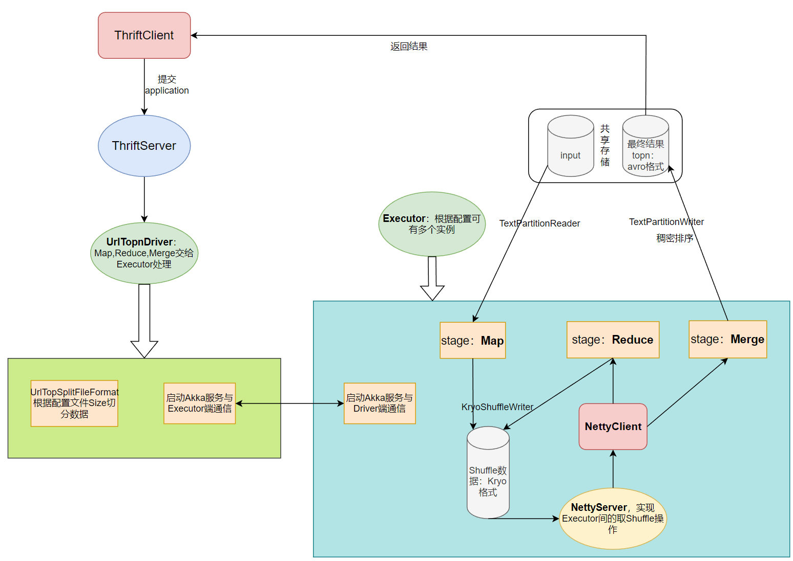
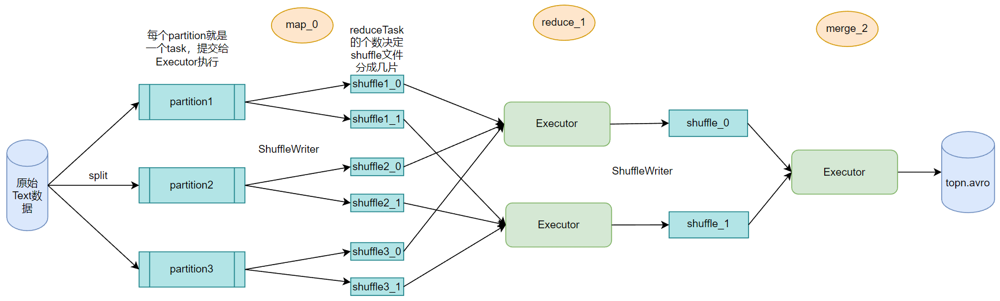

## 构建分布式URL分析计算框架

实现一个分布式计算框架。此框架的自带一功能是支持“计算URL访问频率TOP N”的计算服务。topN排序采用稠密排序，基于指定配置文件，
框架会启动一个master进程及一定数量的slave进程,并根据配置自动完成首次的URL访问频率计算。
此外，master进程会依据给定的Thrift IDL文件为外部提供“计算URL访问频率TOP N”的Thrift服务。
启动相关的操作都被封装在`startMR.sh`脚本中。执行此脚本即可启动整个分布式计算框架及其相关服务。
此脚本放置于工程根目录的`bin/`下。执行`mvn clean package`命令打的JAR包为胖JAR。

> 1.  实现FileFormat 接口，能够根据配置的分片大小对大文件进行切分，且当切分到url中间时候能自动切换下一行。
>
> 2.  RPC通信，Driver端和Executor端的通信使用Akka框架进行通信，并支持动态注册。
>
> 3.  任务调度：实现根据资源和输入参数的信息，进行任务调度的功能。
> 4.  Shuffle：实现shuffle的读写功能，使用Netty进行shuffle读的操作。每个Executor都需要启动一个Netty服务端，客户端通过Netty读取shuffle数据到本地阻塞队列。
>
> 5. 框架通用性：分布式框架具有通用性，Map，Reduce，Merge 接口可扩展，分配的Task也可以扩展。
>
> 6. 计算逻辑执行：Master/Driver 只负责任务调度和管理，所有真正的计算逻辑在 Slave/Executor 的 MR 任务中执行。
>
> 7. Shuffle 读写使用 Kryo 进行序列化，结果数据使用 Avro 格式进行存储。
>
> 8. Map，Reduce和Merge阶段任务都采取流式读取。
> 9. Thrift服务端暴露三个方法，submitApp提交任务，getAppStatus获取app状态，getTopNAppResult获取topn结果。

### 框架流程图：

### 数据流向图：

windows下单机测试：
1. 修改bin目录下配置文件中所有ip为127.0.0.1，urltopn.conf下输入输出修改为你自己的路径，程序会读取bin目录下所有的配置。
2. shuffle默认路径为：java.io.tmpdir+/shuffle，可以在AppConfig修改路径。
3. 在pom文件中修改你的thrift.exe的路径，<thrift.executable>E:\programs\thrift\thrift.exe</thrift.executable>
4. 执行mvn compile，会生成thrift代码，不然项目会确实thrift代码报错。
5. urltopn.conf下如果配置分片大小太小或者reduceTask数量太大会导致分片太多，Executor端的netty客户端会产生大量tcp连接，占用过多端口导致程序执行失败，我测试TCP连接数达到300的时候就会报错，请自行调整这两个参数大小。
6. 先执行ThriftServer的main方法，此方法中启动了Thrift服务和Driver端的Akka服务。再执行Executor的main方法，启动Executor端的Akka服务和Netty服务。最后调用SendApplicationClient的main方法提交任务。

liunx下项目单机启动顺序：
1. 在pom文件中修改你的thrift.exe的路径，<thrift.executable>E:\programs\thrift\thrift.exe</thrift.executable>
2. mvn clean package
3. 把打的胖jar复制到bin目录下。
4. 执行. startMR.sh会根据master.conf，slave.conf和urltopn.conf启动第一次urlTopN计算。
5. 项目默认提供了ThriftClient类连接服务端的客户端main方法。可以自行测试如下命令。
java -cp <JAR_PATH> com.ksc.wordcount.thrift.client.SendApplicationClient <urltop.conf_PATH> 
6. shuffle默认路径为：java.io.tmpdir+/shuffle，可以在AppConfig修改路径。
7. 除了shuffle路径，项目其他所有需要改动的参数都在bin目录下的配置文件中修改。

liunx下分布式部署：
1. startMR.sh可以通过ssh连接到其他机器，确保bin目录下内容和胖jar，在对应服务器上都存在并和Master机器路径一致。
2. 确保urltop.conf里面的输入输出路径都是共享存储，不然executor端取不到数据。
3. 配置好ssh免密登录.
4. 执行startMR.sh.